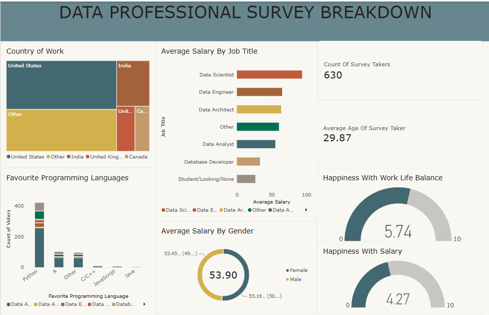

# Data Professional Survey — Power BI Dashboard

An interactive Power BI dashboard analyzing responses from **630 data
professionals** — their salaries, preferred programming languages,
countries of work, and job satisfaction. Built to answer a simple
question: *what does the data industry actually look like from the
inside?*

**Tool:** Microsoft Power BI Desktop
**Dataset:** Data Professional Survey (public, 630 responses)

---

## Dashboard overview

The dashboard presents eight views in a single layout:

| Visual | Type | What it shows |
|---|---|---|
| Count of Survey Takers | KPI card | 630 respondents |
| Average Age of Survey Taker | KPI card | 29.87 years |
| Country of Work | Treemap | Geographic distribution of respondents |
| Average Salary by Job Title | Horizontal bar | Salary comparison across 7 roles |
| Favourite Programming Languages | Stacked bar | Language preference among respondents |
| Average Salary by Gender | Donut | Gender pay comparison at the average level |
| Happiness with Work-Life Balance | Gauge | Scored 5.74 / 10 |
| Happiness with Salary | Gauge | Scored 4.27 / 10 |

---

## Key findings

### 1. Python dominates programming language preference

Python received roughly **400 votes** — more than every other language
combined. R sits second at around **100 votes**, with "Other,"
JavaScript, C/C++, and Java trailing far behind. For anyone entering
the field: **Python is the clear default choice.**

### 2. The United States dominates the survey population

The treemap shows the **United States** as the largest single group,
followed by **India**, then smaller representation from the UK, Canada,
and other countries. Findings about salary and satisfaction are
therefore skewed toward US-based professionals — worth keeping in mind
when interpreting the numbers.

### 3. Average salary is nearly gender-equal — but context matters

Average salary by gender shows **Female $53.90K** vs **Male $53.45K**
— essentially parity at the aggregate level. This is a notable finding,
but it only reflects the *mean* across all roles. It does not rule out
pay gaps within specific job titles or seniority levels. A deeper
analysis would segment by role.

### 4. Work-life balance beats salary satisfaction by a wide margin

Respondents rated **work-life balance at 5.74 / 10** and **salary at
4.27 / 10** — a **1.47-point gap**. Data professionals appear happier
with how they spend their time than with what they're paid. This is a
common finding in the industry and supports the view that compensation
— not workload — is the primary source of dissatisfaction.

### 5. Salary varies sharply by job title

Data Scientists and Data Engineers sit at the top of the salary
distribution, with Data Analysts and Database Developers lower down.
As expected, "Student/Looking for work" is the lowest-paid segment.

---

## Files in this repo

| File | What it is |
|---|---|
| `data_professional_survey.pbix` | Power BI workbook — the full interactive dashboard |
| `survey_data_raw.xlsx` | Original survey data (uncleaned) |
| `01-dashboard.png` | Static screenshot of the dashboard |

---

## Notes

- **GitHub does not preview `.pbix` files.** Download the workbook and
  open it in Power BI Desktop to interact with the visuals.
- The raw source data is included so the dashboard can be reproduced
  from scratch.

---

## Skills demonstrated

- Power BI data modelling and transformation
- DAX measures for aggregations (average salary, satisfaction scores)
- Visual design — choosing appropriate chart types (treemap, bar,
  donut, gauge, KPI cards)
- Dashboard layout and composition
- Business framing — moving from raw survey data to a narrative about
  the data industry
